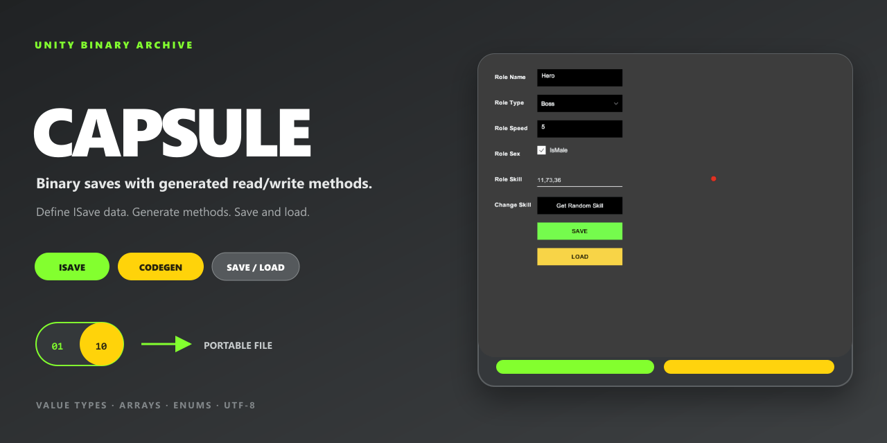

# Capsule

[English](README.md)

适合小型单机游戏的轻量二进制本地存档库。



## 项目包含什么

- 二进制本地存档。
- 生成序列化辅助代码。
- 包含 Unity 包、示例和测试。

## 快速开始

在 Unity 中打开 **Window → Package Manager**，选择 **Add package from git URL**，输入：

```text
https://github.com/onovich/Capsule.git?path=/Assets/com.mortise.capsule#main
```

包元数据声明支持 Unity `2019.4` 及以上版本。

仓库本身也可以作为 Unity 示例工程打开。

## 示例

```csharp
// Data
public struct SampleRoleDBModel : ISave {

  public string name;
  public RoleType roleType;
  public int[] skillTypeIDArr;

  // Generated Code
  public void WriteTo(byte[] dst, ref int offset) {
    ByteWriter.WriteUTF8String(dst, name, ref offset);
    ByteWriter.Write<Int32>(dst, (Int32)roleType, ref offset);
    ByteWriter.WriteArray<Int32>(dst, skillTypeIDArr, ref offset);
  }

  public void FromBytes(byte[] src, ref int offset) {
    name = ByteReader.ReadUTF8String(src, ref offset);
    roleType = (RoleType)ByteReader.Read<Int32>(src, ref offset);
    skillTypeIDArr = ByteReader.ReadArray<Int32>(src, ref offset);
  }

}
```

## 仓库结构

- `Assets/` — Unity 脚本、场景、包与项目资源。
- `Packages/` — Unity 包依赖。
- `ProjectSettings/` — Unity 工程配置。

## 文档

- [`ARCHITECTURE_GUIDE.md`](ARCHITECTURE_GUIDE.md)
- [`ROADMAP.md`](ROADMAP.md)
- [`SAMPLE_PREFAB_GUIDE.md`](SAMPLE_PREFAB_GUIDE.md)
- [`CODING_STYLE.md`](CODING_STYLE.md)
- [`MEMORY.md`](MEMORY.md)

## 相关项目

- [Oshi](https://github.com/onovich/Oshi)
- [LitIO](https://github.com/onovich/LitIO)

## 当前状态

目前已测试 Mac 和 Windows，尚未测试 Android、iOS 和 WebGL。它不支持多层嵌套和存档结构升级，调整字段可能导致旧存档失效。

## 许可证

本仓库采用 [MIT](LICENSE) 许可证。
